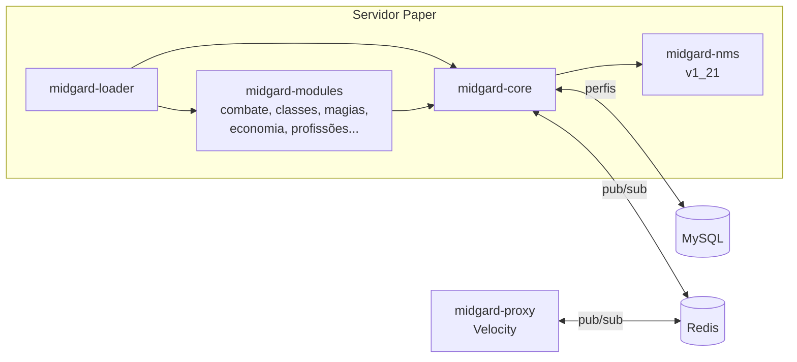
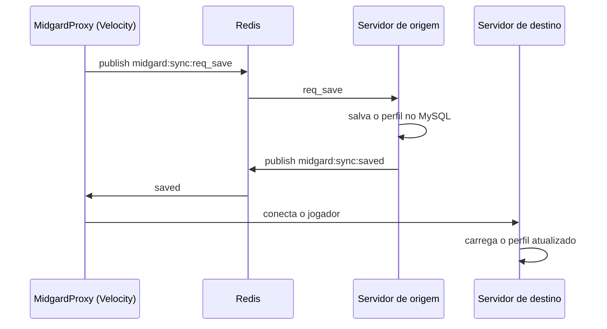

# MidgardRPG


Plugin de RPG modular para servidores Minecraft (Paper 1.21), escrito em Java. Um núcleo (`midgard-core`) oferece
serviços comuns e cada sistema de jogo é um módulo independente, carregado pelo `midgard-loader`.

## Destaques

- **Arquitetura modular**: 13 módulos de jogo (personagem, classes, combate, comandos, economia, essentials,
  itens, profissões, raças, magias, segurança, desempenho e integração com MythicMobs) sobre um núcleo compartilhado.
- **Núcleo**: atributos e modificadores, efeitos de status, sistema de dano próprio, perfis de jogador
  persistentes, loot tables, leaderboards, scoreboard, GUIs paginadas, i18n com validação de chaves ausentes.
- **Persistência e rede**: MySQL (HikariCP) e sincronização entre servidores via Redis; módulo `midgard-proxy`
  para Velocity.
- **Compatibilidade de versão**: a camada `midgard-nms` isola o código que depende da versão do servidor.
- **Integrações**: Vault, WorldGuard, MythicMobs, PlaceholderAPI, TAB.

## Stack

Java 21 · Maven (multi-módulo) · Paper API · MySQL/HikariCP · Redis · Velocity

## Estrutura

```
midgard-core/      serviços compartilhados (atributos, combate, perfis, GUI, i18n, banco, Redis)
midgard-modules/   um módulo por sistema de jogo
midgard-loader/    plugin que carrega o núcleo e os módulos
midgard-nms/       código específico da versão do servidor
midgard-proxy/     plugin Velocity
```

## Arquitetura



### Troca de servidor sem perder dados

Antes de mover o jogador, o proxy ([MidgardProxy](https://github.com/EduardoPSoares/MidgardProxy)) pede ao
servidor de origem que salve o perfil e espera a confirmação (até 2 s) antes de conectar no destino.



## Como compilar

```bash
./mvnw package -pl midgard-loader -am
```

O jar sai em `midgard-loader/target/`.
